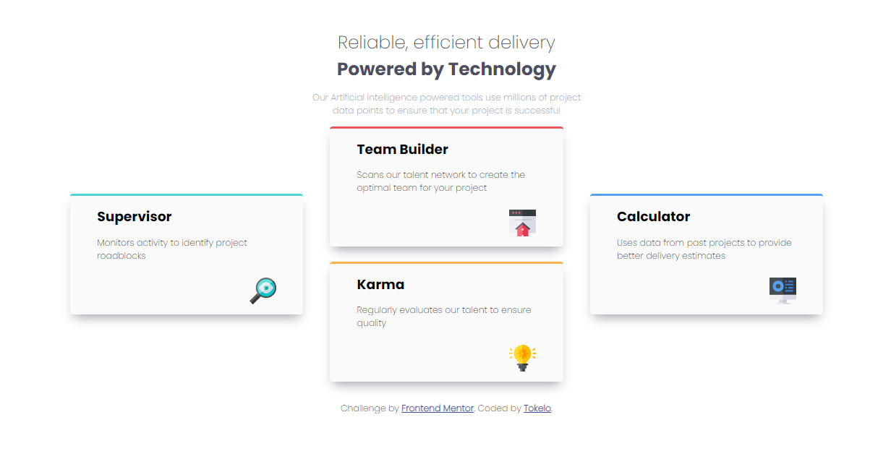

# Frontend Mentor - Four card feature section solution

This is a solution to the [Four card feature section challenge on Frontend Mentor](https://www.frontendmentor.io/challenges/four-card-feature-section-weK1eFYK). Frontend Mentor challenges help you improve your coding skills by building realistic projects. 

## Table of contents

- [Overview](#overview)
  - [The challenge](#the-challenge)
  - [Screenshot](#screenshot)
  - [Links](#links)
- [My process](#my-process)
  - [Built with](#built-with)
  - [What I learned](#what-i-learned)
  - [Author](#author)

## Overview

### The challenge

Users should be able to:

- View the optimal layout for the site depending on their device's screen size

### Screenshot
  
   

### Links

- Solution URL: [GitHub code solution URL](https://github.com/Kennedy-was-taken/four-card-feature-section-master)
- Live site Url : [Vercel QR code app](https://four-card-feature-section-master-zeta-snowy.vercel.app)

### Built with

- Semantic HTML5 markup
- CSS custom properties
- Flexbox
- Mobile-first workflow
- @media

### What I learned

1. Custom Element Positioning : 

    Throughout the development of this frontend, I acquired the skill of positioning elements at specific coordinates that don't adhere to the traditional grid or flex layout. This flexibility allowed for more precise control over the visual arrangement of elements on the page.

2. Utilizing Scale Effect : 

    I learned how to incorporate the scale effect to enhance user interactions. By applying scale transformations, I created a dynamic user experience where elements increase in size by 10% when interacted with. This effect was tailored to different devices, triggering on click for mobile devices and on hover for desktop devices.

3. Mobile Interaction Enhancement : 

    For mobile devices, implementing the scale effect on click provided a tactile and responsive interaction. Users could intuitively engage with elements by tapping, resulting in a visually satisfying enlargement of the target.

4. Desktop Hover Interaction : 

    On desktop devices, the scale effect was activated on hover, enriching the browsing experience with subtle yet impactful visual feedback. As users hovered over elements, they experienced a smooth transition, enhancing engagement and interactivity.

## Author

- Github Profile: [Kennedy-was-taken](https://github.com/Kennedy-was-taken)
- Frontend Mentor : [@Kennedy-was-taken](https://www.frontendmentor.io/profile/Kennedy-was-taken)
